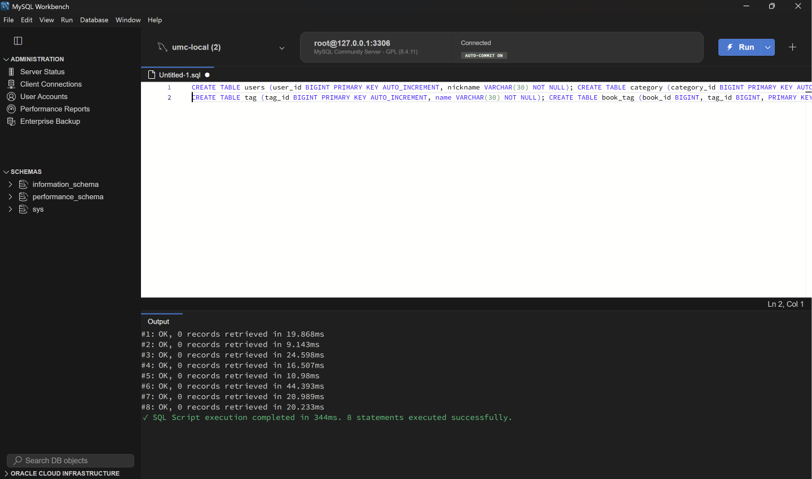
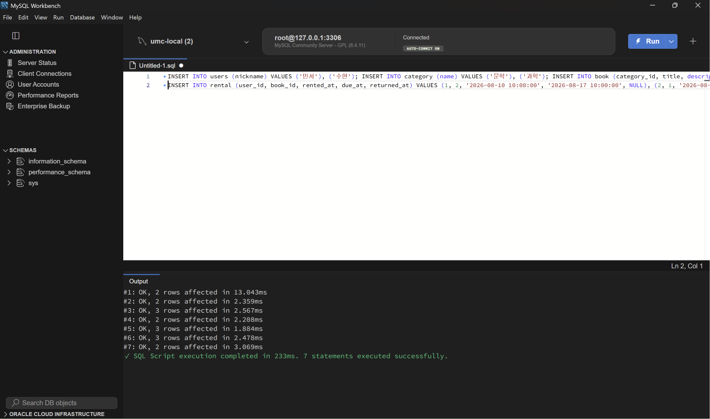
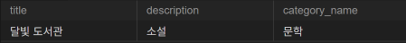
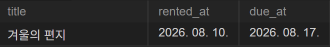
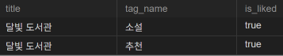

- 어떤 요구사항에서 어떤 테이블을 기준으로 시작했나요?

결과가 "무엇의 목록인가"를 기준으로 시작 테이블을 정했다
미션 1은 책 목록이라 book
미션 2는 사용자의 대여 목록이라 rental
미션 3은 책 상세 화면이라 book,
확장은 한 가게의 리뷰 목록이라 review에서 시작했다

- JOIN이 필요한 이유를 1주차 기준 ERD의 관계로 설명할 수 있나요?

기준 테이블에는 FK 번호만 있고 화면에 보여 줄 이름은 다른 테이블에 있기 때문이다. 미션 1은 book에 category_id만 있어 category와, 미션 2는 rental에 book_id만 있어 book과 JOIN했다. 미션 3의 book과 tag는 N:M이라 직접 이어지는 FK가 없어서 중간 테이블 book_tag를 거쳐 두 번 JOIN해야 했다

- 더미 데이터에서 결과가 예상과 달랐을 때 어떤 조건 또는 관계를 먼저 확인했나요?

결과가 0행이거나 예상보다 적을 때는 문법보다 WHERE 조건과 원본 데이터를 먼저 확인했다

미션1 - LIMIT 10인데 1행만 나와 원본을 확인했다
→ 문학이면서 대여 가능한 책이 실제로 1권뿐이었다. 쿼리 오류가 아니라 데이터가 적은 것이었다.

미션3 - 좋아요를 누르지 않은 사용자로 조회하니 태그까지 사라졌다.
→ JOIN 방식을 확인해 짝이 없는 행이 제외되는 것이 원인임을 알고 LEFT JOIN으로 바꿨다.

- **미션 기록**


01_schema.sql·02_seed.sql 실행 확인 화면





미션 1  문학 카테고리의 대여 가능한 도서를 최신순으로 10개 조회합니다.결과에는 책 제목, 설명, 카테고리 이름을 포함합니다.

```jsx
SELECT b.title, b.description, c.name AS category_name FROM book b JOIN category c on b.category_id = c.category_id WHERE c.name = '문학' and b.is_available = TRUE ORDER BY b.book_id DESC LIMIT 10;
```

실행 결과



- 기준 테이블 -  book
- JOIN - 카테고리 이름이 category에 있어서 book.category_id와 category.category_id로 연결 (book→category)
- WHERE - 카테고리가 ‘문학’ + 대여 가능
- 정렬, 범위 기준 - book_id 내림차순(최신순), 최대 10개
- 문학 책 2권 중 대여 중인 겨울의 편지가 제외되고 1권만 나와 요구사항과 일치한다

미션 2 특정 사용자가 아직 반납하지 않은 책을 반납 예정일 순으로 조회합니다. 결과에는 책 제목, 대여일, 반납 예정일을 포함합니다.

```jsx
SELECT b.title, r.rented_at, r.due_at FROM rental r JOIN book b on b.book_id = r.book_id WHERE r.returned_at IS NULL AND r.user_id = 1 ORDER BY r.due_at ASC, r.rental_id ASC;
```

실행 결과



- 기준 테이블 -  rental
- JOIN - 책 제목이 book에 있어서 연결 (rental → book)
- WHERE - 특정 사용자라 user_id = 1 + 반납일이 NULL
- 정렬, 범위 기준 - 반납이 급한 순서로 due_at 오름차순, 예정일이 같을 때를 대비해 rental_id로 보조 정렬
- 민서의 대여 중 returned_at이 NULL인 겨울의 편지만 나오고 반납이 끝난 대여는 제외되어 요구사항과 일치한다

미션 3  특정 책의 태그 목록과 특정 사용자의 좋아요 여부를 조회합니다.

```jsx
SELECT b.title, t.name AS tag_name, bl.user_id IS NOT NULL AS is_liked
FROM book b
JOIN book_tag bt ON b.book_id = bt.book_id
JOIN tag t ON bt.tag_id = t.tag_id
LEFT JOIN book_like bl ON b.book_id = bl.book_id AND bl.user_id = 1
WHERE b.book_id = 1
ORDER BY t.tag_id ASC;
```

실행 결과



- 기준 테이블 -  book(책 상세 화면이므로)
- JOIN - 태그 이름이 tag에 있는데 book과 tag는 N:M이라 book_tag를 거쳐 두 번 연결 (book → book_tag → tag)
- LEFT JOIN - 좋아요는 book_like에 짝이 있는지로 판단. 안 눌렀을 때 태그까지 사라지지 않도록 그냥 JOIN 대신 사용 (book → book_like)
- WHERE - 특정 책이라 book_id = 1, 사용자 조건은 WHERE에 넣으면 NULL 행이 걸러져서 ON에 user_id = 1로 넣음
- 정렬, 범위 기준 - 태그가 여러 개 나오므로 매번 같은 순서가 되도록 tag_id 오름차순
- 1번 책의 태그 소설·추천 2개가 나오고, 좋아요를 누른 민서는 is_liked가 true로 나와 요구사항과 일치한다.

확장 자신의 1주차 ERD에서 같은 방식으로 화면 조회 요구사항 1개와 SQL을 작성합니다.

요구사항 - "가게 상세 화면에서 해당 가게의 리뷰를 작성자 이름, 별점과 함께 최신순으로 10개 보여 준다.”

```jsx
SELECT m.name AS writer_name, r.rating, r.content, r.created_at
FROM review r
JOIN member m ON r.member_id = m.member_id
WHERE r.store_id = 1 AND r.deleted_at IS NULL
ORDER BY r.created_at DESC, r.review_id DESC
LIMIT 10;
```

- 기준 테이블 - review, 결과가 한 가게의 리뷰 목록이므로
- JOIN - 작성자 이름이 member에 있어서 review.member_id와 member.member_id로 연결 (review → member)
- WHERE - 선택한 가게라 store_id = 1, 삭제된 리뷰는 제외하려고 deleted_at IS NULL 추가
- 정렬, 범위 기준 - 최신 리뷰부터 보여 주려고 created_at 내림차순, 같은 시각을 대비해 review_id 보조 정렬, 10개 보여줘야 하므로 LIMIT 10